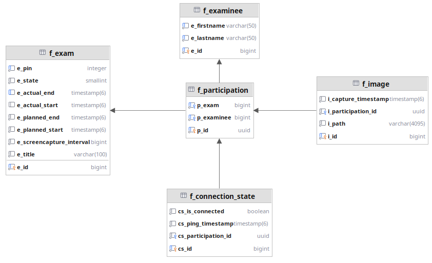

:revealjs_theme: white
:customcss: css/presentation.css
ifdef::env-ide[]
:imagesdir: ../images
endif::[]

[.title]
= Franklyn

[pass]
++++

++++

[.font-xx-large]
== Was ist Franklyn
* Ermöglicht praxisnahes Arbeiten bei Leistungsfeststellungen
* Besonders: Recherche im Internet
** z.B. Stack Overflow, Dokumentation
* Gleichzeit: Gewissheit für Lehrpersonen, dass
** Regeln eingehalten werden
*** keine Kommunikation zwischen den Schülern stattfindet
*** keine fertigen Programme/Lösungen kopiert werden

[.font-xx-large]
=== Änderungen

* Franklyn 3 "Eintestversion" mit dem Rust-Client läuft jetzt wieder in der Schule. (Cvijić und Schnalzenberger)
* openbox rust alpha/beta frames (Cvijić)
* GitHub actions windows build (Cvijić)
* Downloads der neuen Openbox sind jetzt auch wieder über die Franklyn 3 Website möglich (Cvijić)
** https://franklyn3.htl-leonding.ac.at/[Franklyn3]
* Mehrtestfähigkeit

=== Live Demo

=== Architektur
plantuml::./plantuml/architecture.puml[]

=== CLD

[.font-xx-large]
=== [.margin-b-10]#Terminologie#
* *OpenBox*: Applikation auf dem Rechner der Schüler
** Warum OpenBox?
*** Für den Prüfer ist der Rechner des Schülers wie eine undurchsichtige Box
*** Mit der Franklyn Applikation kann diese Box geöffnet und daraus Informationen gewonnen werden (z.B. screenshot)
* *Server*: Quarkus backend zum Verwalten von Boxen und Aufzeichnungen
* *Frontend*: Angular Frontend zum Anzeigen der aus den Boxen gewonnenen Daten

[.font-xx-large]
== Team
* Tobias Aichinger
* Luka Cvijić
* Julian Schludermann
* Arwed Schnalzenberger
